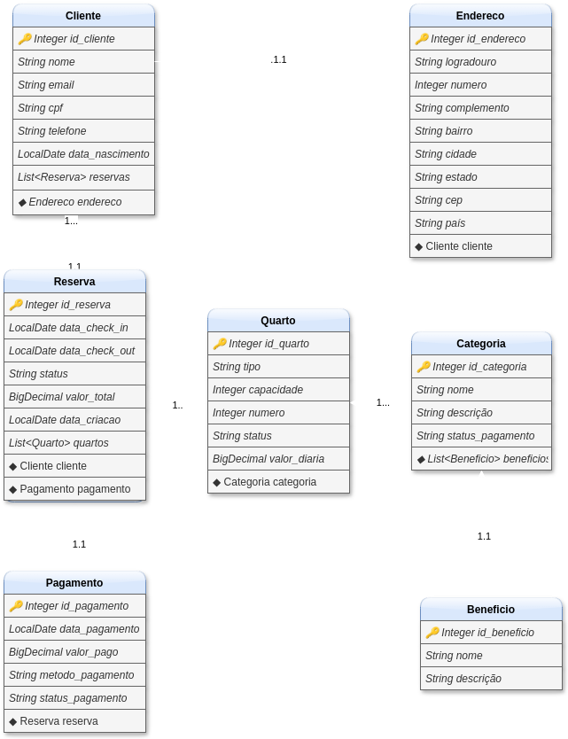

# Sistema de reservas de hotel 🏨

**Arquitetura:** AO sistema de reservas seguirá uma arquitetura monolítica baseada no padrão RESTful e no Domain-Driven Design (DDD)
para uma modelagem eficiente. O foco será em performance, escalabilidade e otimização do banco de dados, utilizando caching
para suportar grandes volumes de requisições. A estrutura inicial permitirá evolução ágil, com transição para microsserviços
no futuro, se necessário. Serão aplicadas práticas de Clean Code, SOLID e Test-Driven Development (TDD), garantindo código
limpo, testável e fácil de manter.

 

**Objetivo:** O objetivo deste projeto é criar um sistema de reservas de hotel que, inicialmente, forneça funcionalidades
essenciais como o gerenciamento de clientes, reservas, quartos, categorias, benefícios, pagamentos e endereços por meio de
operações de CRUD. O sistema também permitirá consultas personalizadas, como o histórico de reservas e a disponibilidade 
em tempo real dos quartos. A lógica de negócios garantirá a disponibilidade de quartos, o processamento de pagamentos e 
a aplicação de benefícios nas reservas. A longo prazo, o sistema será aprimorado para suportar melhorias como segurança,
mensageria para notificações, e escalabilidade para atender a um número crescente de usuários e reservas. O foco será em
fornecer uma plataforma de alta performance, capaz de evoluir com as necessidades do negócio.

 

## Resumo técnico

   **Versões:** Este projeto foi desenvolvido com Java 17, utilizando o Spring Framework 3.4.2 para implementar a lógica
   de aplicação. A gestão de dependências é feita através do Maven. O banco de dados utilizado é o PostgreSQL versão 13.x,
   garantindo a persistência dos dados e alta performance nas consultas.

 

## Diagrama de Classes

  

 

## Banco de dados

**Instância**: Este projeto utiliza o PostgreSQL hospedado no Render. Para configurar e acessar o banco de dados, siga os passos abaixo:

- Para gerenciar o banco de dados de forma visual, você pode usar o pgAdmin - Baixe e instale o pgAdmin em [pgadmin.org](pgadmin.org).
- Abra o pgAdmin e, na interface, clique com o botão direito em "Servers" e selecione Create > Server.
- Na janela que abrir, insira as informações de conexão do Render, como Name, Host, Port, Username e Password. (Dados fornecidos pela Render).

Para acessar os dados da instância do banco de dados, entre em contato com a [Ana Ingrid](https://github.com/ana-ingrid).

 

## Como realizar a organização dentro do seu Fork 📂

**Branches de Funcionalidades:** Para cada tarefa ou funcionalidade específica, crie uma branch separada. Isso facilita o trabalho
colaborativo e mantém o código organizado, evitando sobrecarga na branch principal. Algumas convenções de nome para as branches:

- feature/crud-clientes
- feature/crud-reservas
- feature/consultas-personalizadas
- feature/integracao-pgadmin

**Pull Requests (PRs):** Ao finalizar uma tarefa, crie um Pull Request para mesclar as alterações da sua branch de funcionalidades
na branch principal (main) do repositório principal. Certifique-se de que o PR está associado à issue correspondente, para que todos possam acompanhar o progresso da tarefa.